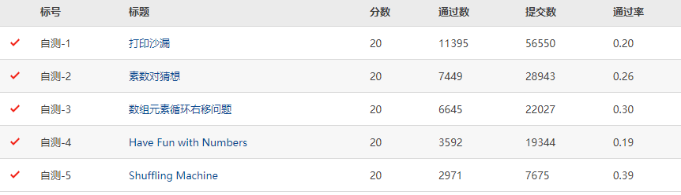

本文件夹下为中国大学MOOC-陈越、何钦铭-数据结构-起步能力自测题自己做的答案，未必是最优解。但是全部通过了。

题目原始链接：https://pintia.cn/problem-sets/17/problems/type/7

题目列表：

1. 打印沙漏
2. 素数对猜想
3. 数组元素循环右移问题
4. Have Fun with Numbers
5. Shuffling Machine