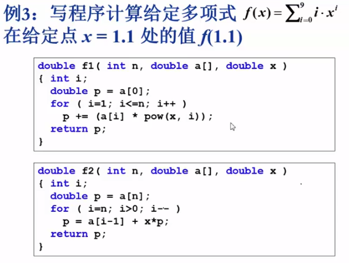

# 一、基本概念

*（浙江大学数据结构课程笔记）课程网址：https://www.icourse163.org/learn/ZJU-93001?tid=1207006212#/learn/content?type=detail&id=1212031623*

[toc]

## 1. 什么是数据结构

数据结构和算法这两个词经常在一起。

三个例子：

例子1：如何在书架上摆放图书？

>  给定一些书架和一堆书，如何把书放到书架上去呢？换言之，给了一堆数据，然后给定一些存储空间，如何存储数据？

这个问题不科学，因为未限定书架的样子。当问一个数据如何组织的时候，其实是和这个数据规模有关系，不一样规模的问题，其处理难度不一样。难度在于放这个书是为了做事情用。

图书的摆放要使得2个相关操作方便实现：

> 操作1：新书如何插入？

> 操作2：如何找到某本指定的书？

* 方法1：随便放

  ​	操作1：新书插入：哪儿有空就放哪，一步到位

  ​	操作2：如何找到某本指定的书？：累死，工作量特别大

* 方法2：按照书名的拼音字母顺序排放

  操作1：新书插入：比较麻烦，若要插入A开头的书本，则需要将后面的书每个都向后挪一位。

  操作2：如何找到某本指定的书？

  ​	二分查找：假设查找书书名以S开头，如果当前书名第一个字母为L，则第二次查找在L-Z这个区间查找，若第二次得到的书书名第一个字母为X，则第三次在L-S这个范围查找，以此类推直到找到目标书本。

* 方法3：把书架划分为几块区域，每块区域指定摆放某种类别的图书，在每种类别内，按照书名的拼音字母顺序排放

  操作1：新书插入：

  ​	先定类别，二分查找确定位置，移出空位

  操作2：如何找到某本指定的书？

  ​	先定类别，再二分查找

  > 问题：
  >
  > ​	1.书架的每块区域划分大小如何确定？即空间如何分配？
  >
  > ​	2.书架应该划分为几块区域？
  >
  > 区域太少，则每次查找工作量依旧很大；区域太多，则难以查找类别。

**例子1得出的结论：解决问题方法的效率跟数据的组织方式有关。**

*[详细的二分查找算法] https://www.cnblogs.com/kyoner/p/11080078.html*

例子2：写程序实现一个函数PrintN，使得传入一个正整数为N的参数后，能顺序打印从１到N的全部正整数。

```c
// 循环实现：
		void PrintN(int N)
		{
			int i;
			for (i = 1; i <= N; i++)
				printf("%d\n", i);
		}
		// 当N为十万时，可以正常运行。
// 递归实现：
		void PrintN(int N)
		{
			if (N)
			{
				printN(N - 1);
				printf("%d\n", N);
			}
		}
		// 当N为十万时，无法正常运行。空间不够，程序非正常终止。
		//（计算机非常不喜欢递归程序，过于占用空间）
```

**例子2得到的结论是解决问题方法的效率，跟空间的利用效率有关。**

例子3：写程序计算给定多项式在给定点x处的值




* 方法1：

  

  ```c
  double f(int n, double a[], double x)
  {
  	int i;
  	double p = a[0];
  	for (i = 1; i < n; i++)
  	{
  		p += (a[i] * pow(x, i));
  	}
  	return p;
  }
  ```

  

* 方法2：

  

  ```c
  double f(int n, double a[], double x)
  {
  	int i;
  	double p = a[n];
  	for (i = n; i > 0; i--)
  	{
  		p = a[i - 1] + x * p;
  	}
  	return p;
  }
  ```

  两个方法的运行时间：

  

  *函数运行太快，运行时间不到一个tick，此时可以重复跑，总时间除以重复次数*

  

  第一个算法比第二个算法相差了一个数量级。

**例子3得出的结论为：解决问题方法的效率，跟算法的巧妙程度有关**

**到底什么是数据结构：**

+ 数据对象在计算机中的组织方式

  ​	逻辑结构：

  ​	物理存储结构：

+ 数据对象必定与一系列加在其上的操作相关联

+ 完成这些操作所用的方法就是**算法**

描述数据结构的方法为抽象**数据类型（Abstract Data Type）**

数据类型：

* 数据对象集：是什么东西

* 数据集合相关联的操作集：函数

 抽象：描述数据类型的方法不依赖与具体实现

- 与存放数据的机器无关
- 与数据存储的物理结构无关
- 与实现操作的方法和编程语言均无关

只描述数据对象集和相关操作集“是什么”，并不涉及“如何做到”的问题。

 

何谓抽象：

1. 只说明是值，具体类型不关心。

2. 只说明矩阵为M*N，不关心实现

3. 描述函数的时候没有描述具体实现方法和语言实现。

## 2. 什么是算法

算法（Algorithm）

- 一个有限指令集

- 接受一些输入（有些情况下不需要输入）

- 产生输出

- 一定在有限步骤之后终止

- 每一条指令必须

- - 有充分明确的目标，不可以有歧义
  - 计算机能处理的范围之内
  - 描述应该不依赖于任何一种计算机语言以及具体的实现手段


抽象：

- list到底是数组还是链表，虽然看上去很像数组
- swap用函数还是用宏实现？

选择排序算法：

从没有排序的元素中选择一个最小的元素，贴在已经排好序的元素的最后面。最后得到的就是一个从小到大排好序的序列。

## 3. 什么是好的算法？

​	空间复杂度S(n)—根据算法写成的程序在执行时占用存储单元的长度。这个长度往往与输入数据的规模有关。空间复杂度过高的算法可能导致使用的内存超限，造成程序非正常中断。

​	时间复杂度T(n)—根据算法写成的程序在执行时耗费时间长度。这个长度往往也与输入数据的规模有关。时间复杂度过高的低效算法可能导致我们有生之年都等不到运行结果。


因为使用空间是有限的，当N非常大时，有限空间就爆掉了，程序就退出了。

**循环实现只涉及了一个变量和for循环，未设计函数调用，所以不管N多大，它占用的空间始终都是一个固定的，占用空间量是个常量，不会随着N的增长而增长。**

计算函数运行效率的时候，基本等于数函数做了多少次乘除法，加减法可以忽略不记。


当n很大时，n平方远远超过n。


**一般分析采用最坏情况的复杂度**

复杂度的渐进表示法：我们关心的是随着数据规模增大，复杂读增长性质会咋样。对算法不做非常精确的分析，只需要粗略知道其增长趋势就可以了。从而有了渐进表示法


我们在讨论算法上界和下界时，要注意一个算法的上界和下界不是唯一的，有可能有无穷多个。但是太大的上界和太小的下界，对我们分析一个算法效率而言是没有帮助的。我们分析算法效率时，是希望不管是上界还是下界，都尽可能跟它们的真实情况越贴近越好。**所以上界一般取能找到的最小上界，取下界时取能找到的最大下界。**


对于复杂度为n平方的算法，应该想办法将其复杂度降为nlog(n)。


## 4. 应用实例：最大子列和问题

给定K个整数组成的序列{ N1, N2, ..., NK }，“连续子列”被定义为{ Ni, Ni+1, ..., Nj }，其中 1≤i≤j≤K。“最大子列和”则被定义为所有连续子列元素的和中最大者。例如给定序列{ -2, 11, -4, 13, -5, -2 }，其连续子列{ 11, -4, 13 }有最大的和20。现要求你编写程序，计算给定整数序列的最大子列和。


如果和为负数，返回0作为结束。

* 算法1：算出所有连续序列的和，寻找出最大的一个。


* 算法2：去除第一个算法里面最里层的循环

  

* 算法3：分而治之

  把大的复杂的问题切割成小块，然后分头去解决它们。最后再将结果进行合并。

  具体实现：

  ​	将数组一分为二，然后递归去解决左右两边的问题。分别得到左右两边的最大子列和，然后再求得跨越边界的最大子列和。整个数组的最大子列和为上述三个数中的最大值

  

  

* 算法4：在线处理

  

  算法副作用：正确性不是特别明显，理解其工作原理比较困难。

  “在线”的意思是指每输入一个数据就进行即使处理，在任何一个地方终止输入，算法都能正确给出当前的解。

## 课后习题

1. 二分查找

2. 并列和对应相同i但是不同j，即尾是0 选项编译不过


3. 

